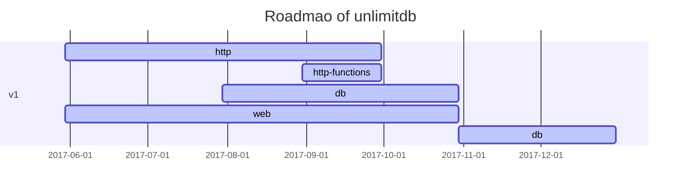

# unlimit

JavaScript first cloud database system.

## Core feature

* Mongo-like interface
  * Document modal
  * Graph modal (Extend)
  * File modal
* http server 
  * HTTPS support
  * CNAME support
* Web user interface

## Roadmap

## License 
MIT license.
