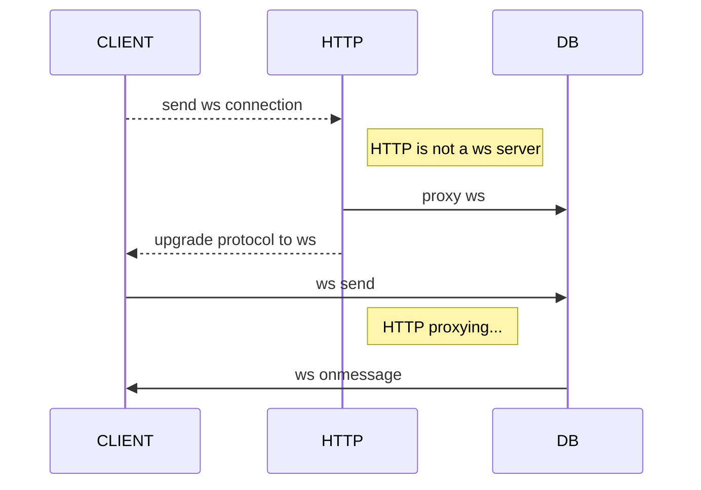
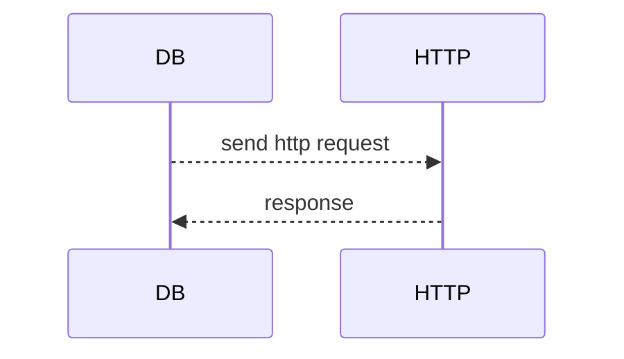

## http request

```mermaid
sequenceDiagram
    CLIENT-->>HTTP: send a request
    activate HTTP
    HTTP-->>CLIENT: response
    deactivate John
```

## http request with db

first, config server db connection

```mermaid
sequenceDiagram
    CLIENT-->>HTTP: send a request
    activate HTTP
    HTTP->>DB: websocket send
    DB->>HTTP: websocket onmessage
    HTTP-->>CLIENT: response
    deactivate John
```

## proxy websocket to db


## db control http 

