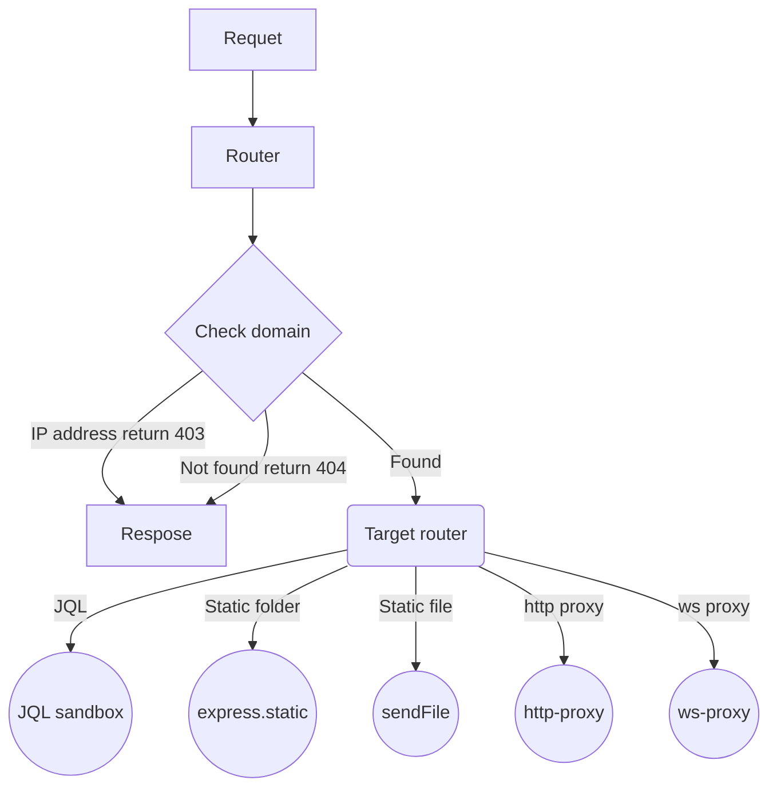

# @unlimit/http

## Flowchat 

mermaid:

Every unit of router is a cached function named `$domain/$functionName`, static proxy/ws proxy/static folder/file will be virtualed as a internal function to be able to called by user functions.

There will be only two sandbox, one is used to be run client's request JQL, and another is used to run cached functions. Both of them can access the store created with every client request. The JQL sandbox is limited to use little features of js and node.js, and the user function sandbox can use much more feature and be able to access the full store.

The store creator and sandbox is always stable because they're written in core. the JQL and the user functions is not stable because then can be upgrade, remove or  overwritten anytime.
